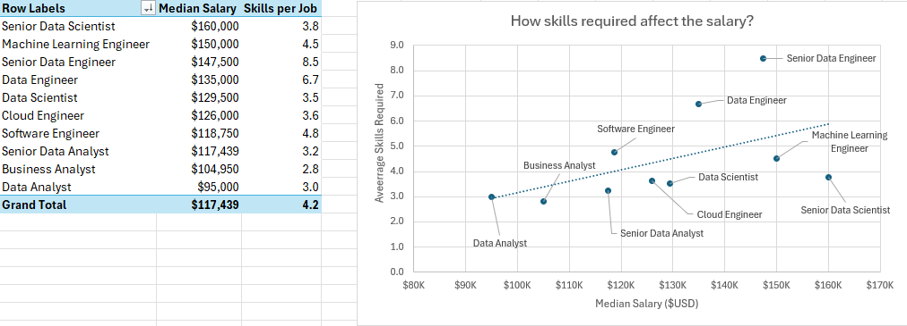

# 📊 Data Job Market Analysis: Skills vs Salary (Excel Project)

## 📌 Overview
This project analyzes global data job postings (2025) with a focus on understanding the relationship between **skills, salaries, and job demand**.

Unlike a standard dashboard project, this analysis emphasizes identifying **patterns and relationships within the data**, simulating a real-world analytical workflow.

---

## 📊 Dataset
The dataset was sourced from **Luke Barousse’s Data Analytics course**, using data collected via the **Data Nerd web scraping tool (datanerd.tech)**.

---

## 🎯 Project Scope
The goal of this project was to answer key analytical questions:
- How do salaries vary across roles?
- Which skills drive higher compensation?
- Is there a relationship between skill complexity and salary?
- How does demand differ across technologies?

---

## 🛠️ Tools & Techniques
- Microsoft Excel  
- Data Cleaning & Transformation  
- Pivot Tables & Advanced Analysis  
- Comparative Analysis  
- Power Queries

---

## 📊 Key Insights

### 💰 Salary Analysis (by Role & Region)

- Data Engineering and Machine Learning roles show the highest salaries  
- US-based roles significantly outperform non-US salaries  

---

### 🧠 Salary vs Skill Complexity

- Jobs requiring more skills tend to offer higher compensation  
- Indicates a premium on versatility and broader technical expertise  

---

### 💡 Skill Salary Analysis

- High-paying skills include:
  - Python  
  - SQL  
  - Snowflake  
- Some frequently required tools are not strongly tied to higher salaries  

---

### 📈 Skill Demand Analysis

- SQL and Excel remain the most in-demand skills  
- Modern tools appear less frequently but offer higher salary potential  

---

## 📂 Files
- `Full_project.xlsx` → complete dataset and full analytical workflow  
- `images/` → visualizations supporting key insights:
  - `salary_analysis.png` → salary comparison by role and region  
  - `salary_vs_skills.png` → relationship between number of skills and salary  
  - `skill_salary_analysis.png` → highest-paying skills  
  - `skill_job_analysis.png` → most in-demand skills  

---

## 🚀 What I Learned
- Performing deeper analytical reasoning beyond dashboards  
- Identifying relationships between variables  
- Structuring multi-sheet analysis in Excel  
- Translating data into actionable insights  

---

## 🙌 Acknowledgements
- **Luke Barousse** for the dataset and course  
- **Data Nerd (datanerd.tech)** for web-scraped data  

---

## 📬 Contact
Feel free to connect with me on LinkedIn to discuss data analytics, projects, or opportunities.